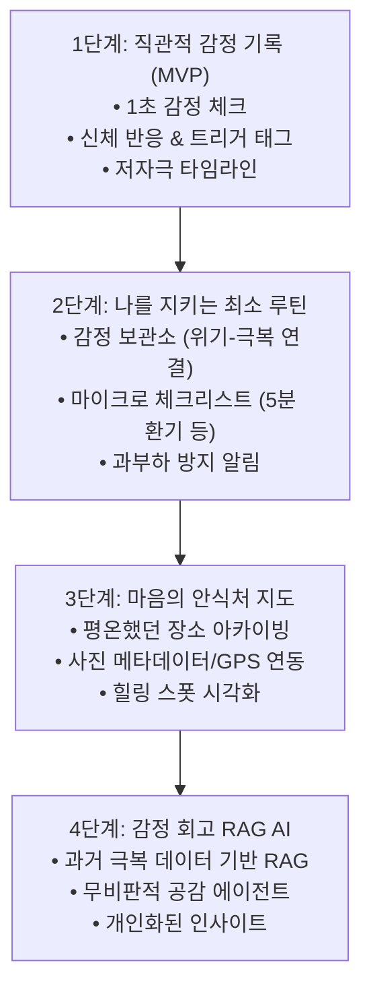

# AmorFati (아모르파티) 🌿
> **"네 운명을 사랑하라(Amor Fati)"**

---

## 📖 1. 프로젝트 소개 (About Project)

**AmorFati**는 세상의 기준에 맞추기 위해 끊임없이 자신을 채찍질하다 번아웃과 상처를 마주한 단 한 사람(개발자 자신)을 위해 시작된 **치유와 자기 수용(Self-Acceptance)의 웹 서비스**입니다.

성인 ADHD와 아스퍼거 증후군(자폐 스펙트럼)의 특성 속에서 겪었던 사회적 스트레스와 깊은 고립감 속에서 깨달은 것은 **지금 나에게 필요한 것은 더 뛰어난 능력이 아니라, 나의 상태를 있는 그대로 인정하고 보살피는 법**이었습니다.

AmorFati는 일상을 채점하거나 반성하게 만드는 다이어리가 아닙니다.  
어떠한 평가나 섣부른 조언 없이, 내 감정과 감각을 고요히 내려놓을 수 있는 **가장 안전한 안식처**를 지향합니다.

---

## 🧭 2. 핵심 가치 & 설계 철학 (Core Values & Philosophy)

| 핵심 가치 | 상세 설명 |
| :--- | :--- |
| **운명애 (Amor Fati)** | 좋았던 순간뿐 아니라, 흔들리고 아팠던 순간까지 모두 나의 일부로 받아들이는 태도 |
| **인지 부하 제로 (Zero Cognitive Load)** | 글을 쓰기 힘들 만큼 에너지가 방전된 날에도 1초 만에 감정을 체크할 수 있는 단순성 |
| **신체와 감정의 연결 (Somatic Awareness)** | 언어화하기 어려운 감정을 신체 반응(가슴 답답함, 근육 긴장 등)과 트리거로 분해하여 인식 |
| **평가 없는 안전지대 (Non-Judgmental Space)** | 연속 기록(Streak) 실패로 자책감을 주지 않고, 언제 돌아와도 묵묵히 반겨주는 따뜻한 인터페이스 |
| **과거의 내가 건네는 위로 (Self-Compassion AI)** | 타인의 상투적인 위로가 아닌, 내가 직접 이겨냈던 과거의 기록을 찾아 건네주는 회고 에이전트 |

---

## 🗺️ 3. 단계별 개발 로드맵 (Roadmap)

### 📍 1단계 (MVP) : 직관적인 감정 기록 (Daylio 스타일)
- **1초 퀵 체크**: 텍스트 입력 부담 없이 색상/아이콘 기반의 직관적 감정 기록
- **신체 감각 & 트리거 태깅**: 감정 식별이 어려울 때 신체 반응(호흡, 근육 긴장도 등)과 환경 요인으로 기록
- **저자극 타임라인**: 화려한 차트 대신 담백하게 감정의 흐름을 조망하는 캘린더/로그 뷰

### 📍 2단계 (확장) : 나를 지키는 최소한의 루틴
- **감정 보관소**: 깊은 침체에 빠졌던 날의 기록과, 그 시기를 무사히 견뎌낸 날의 기록을 연결하여 가시화
- **최소 체크리스트**: '물 한 컵 마시기', '창문 열고 5분 환기', '어깨 힘 빼기' 등 뇌에 과부하를 주지 않는 마이크로 루틴

### 📍 3단계 (공간과 기억) : 마음의 안식처 지도
- **힐링 스폿 아카이빙**: 복잡한 도심을 벗어난 조용한 저수지, 한적한 국도, 모터사이클 라이딩 쉼터 등
- **GPS & 사진 메타데이터**: 평온함을 느꼈던 장소의 사진과 좌표를 기반으로 나만의 쉼터 지도 시각화

### 📍 4단계 (지능형 케어) : 나만의 감정 회고 RAG AI
- **과거의 극복 기록 검색(RAG)**: 불안이나 우울이 엄습할 때, 과거에 유사한 감정을 겪고 잘 지나갔던 내 자신의 기록을 찾아 위로 제공
- **지능형 맥락 분석**: 외부 상투적 답변이 아닌, 오직 나의 기록에 기반한 맞춤형 자기 자비(Self-Compassion) 대화

---

## 🛠️ 4. 기술 스택 (Tech Stack)

### Backend
- **Language & Runtime**: Java 25
- **Framework**: Spring Boot 4.1.1 (WebMVC, Spring Data JPA, Spring Security)
- **Database**: H2 (Local Development) / PostgreSQL (Production)
- **Template Engine**: Thymeleaf (초기 빠른 프로토타이핑 및 저비용 렌더링)

### Frontend & Mobile (Vision)
- **Phase 1 (Web MVP)**: Thymeleaf + Tailwind CSS + Vanilla JS (가볍고 저자극적인 미니멀 UI)
- **Phase 2+ (Mobile)**: Flutter (외출, 라이딩, 이동 중에도 언제든 원터치 기록이 가능한 크로스 플랫폼 클라이언트)

### AI & Vector Store (Phase 4)
- **Architecture**: Spring AI / LangChain RAG
- **Vector DB**: pgvector (PostgreSQL 통합)
- **LLM**: Gemini Pro / Flash API

---

## 🎨 5. UI/UX 디자인 원칙 (Design Principles)

1. **저자극 비주얼 (Low Sensory Overload)**
   - 눈의 피로를 최소화하는 차분한 뉴트럴 톤 및 다크 모드 기본 지원
   - 채도가 너무 높거나 깜빡이는 애니메이션 배제
2. **선택의 피로 최소화 (Frictionless Interaction)**
   - 필수 입력값은 단 1개(감정 점수). 텍스트 메모는 완전한 선택 사항.
   - 단 한 번의 탭으로 저장이 완료되는 플로우
3. **잔잔한 피드백 (Calm Feedback)**
   - 요란한 축하 팝업 대신 부드럽고 잔잔한 미세 애니메이션
   - 스트릭(연속 기록) 압박 제거

---

## 📂 6. 프로젝트 문서 (Documentation)

- [1차 MVP 제품 요구사항 정의서 (PRD - Emotion Tracking)](docs/PRD-01-emotion-recording.md)
- [시스템 아키텍처 및 백엔드 개발 표준 (Architecture Standards)](docs/01-architecture-standards.md)
- [UI 디자인 시스템 및 컴포넌트 가이드 (UI Design Guide)](docs/03-ui-design-guide.md)
