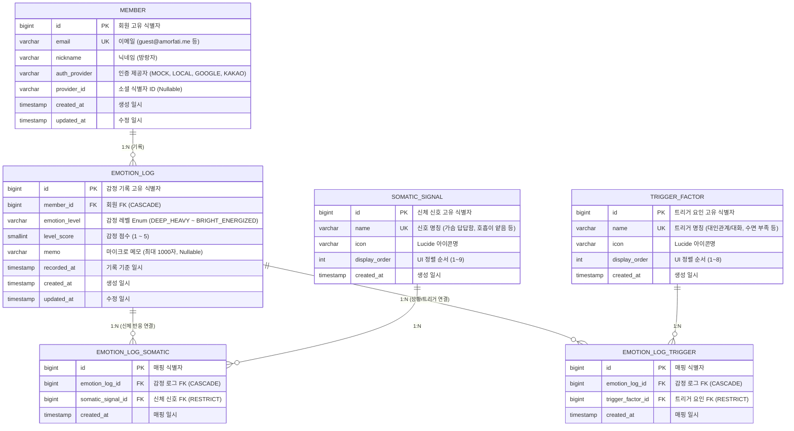

# [Database Design] 데이터베이스 설계 및 ERD 명세서

| 항목 | 내용                                                                                                             |
| :--- |:-----------------------------------------------------------------------------------------------------------------|
| **문서 버전** | v1.0                                                                   |
| **최종 수정일** | 2026-09-01                                                                                                       |
| **적용 데이터베이스** | H2 (Local / Test), PostgreSQL 16+ (Production)                                                                   |
| **정합 대상** | `README.md`, `index.html`, `app.js`, `style.css`, `01-architecture-standards.md`, `PRD-01`                       |
| **문서 목적** | 불필요한 부가 정보(프로필 이미지, 선호테마, 권한)를 제거하고 감정 기록의 본질에 집중한 미니멀 데이터 모델링 확립 |

---

## 1. 데이터 모델링 설계 원칙

AmorFati는 1인 개발 및 성인 ADHD/자폐 스펙트럼의 치유 목적에 맞추어 **가장 단순하고 인지 부하가 없는 데이터 구조**를 지향합니다.

1. **Member 엔티티의 초경량화 (Minimal Account)**:
   - 프로필 이미지, 관리자/사용자 권한(Role), 선호 테마 등 당장 불필요한 복잡한 필드를 배제합니다.
   - 테마 설정은 클라이언트 `localStorage`에서 완결되며, 계정은 오직 **기록의 소유권 식별(`email`, `nickname`, `auth_provider`, `provider_id`)**만을 담당합니다.
2. **신체 반응(`somatic_signal`)과 상황/트리거(`trigger_factor`)의 명시적 분리**:
   - UI 2번 섹션("몸에서 느껴지는 신호" 9종)과 3번 섹션("현재 상황 및 자극 요인" 8종)을 독립된 마스터 테이블로 관리합니다.
3. **커스텀 태그 복잡도 제거 (순수 시스템 프리셋 전용)**:
   - 고정된 17종 프리셋(신체 9종 + 트리거 8종)만을 사용하여 데이터 무결성을 100% 보장합니다.
4. **타임라인 및 통계 조회 성능 최적화**:
   - `(member_id, recorded_at DESC)` 복합 인덱스로 캘린더/타임라인 조회를 고속 처리합니다.

---

## 2. ERD 다이어그램 (Entity Relationship Diagram)



---

## 3. 물리 테이블 상세 명세서 (Physical Schema)

### 3.1 `member` (사용자 계정 식별 테이블)

| 컬럼명 | 타입 | Nullable | 기본값 | 제약조건 | 설명 |
| :--- | :--- | :---: | :---: | :---: | :--- |
| `id` | `BIGINT` | NOT NULL | AUTO_INCREMENT | **PK** | 회원 고유 식별자 |
| `email` | `VARCHAR(100)` | NOT NULL | - | **UK** (`uk_member_email`) | 로그인 및 식별용 이메일 |
| `nickname` | `VARCHAR(50)` | NOT NULL | - | - | 서비스 표시용 닉네임 (기본: '방랑자') |
| `auth_provider` | `VARCHAR(20)` | NOT NULL | `'MOCK'` | - | 가입/인증 경로 (`MOCK`, `LOCAL`, `GOOGLE`, `KAKAO`) |
| `provider_id` | `VARCHAR(100)` | NULL | - | - | OAuth2 소셜 식별자 ID |
| `created_at` | `TIMESTAMP` | NOT NULL | CURRENT_TIMESTAMP | - | 생성 일시 (`BaseTimeEntity`) |
| `updated_at` | `TIMESTAMP` | NOT NULL | CURRENT_TIMESTAMP | - | 최종 수정 일시 (`BaseTimeEntity`) |

---

### 3.2 `emotion_log` (감정 기록 테이블)

| 컬럼명 | 타입 | Nullable | 기본값 | 제약조건 | 설명 |
| :--- | :--- | :---: | :---: | :---: | :--- |
| `id` | `BIGINT` | NOT NULL | AUTO_INCREMENT | **PK** | 감정 기록 고유 식별자 |
| `member_id` | `BIGINT` | NOT NULL | - | **FK** (`fk_emotion_log_member`) | 작성 회원 식별자 (ON DELETE CASCADE) |
| `emotion_level` | `VARCHAR(30)` | NOT NULL | - | - | 감정 레벨 Enum (`DEEP_HEAVY` ~ `BRIGHT_ENERGIZED`) |
| `level_score` | `SMALLINT` | NOT NULL | - | `CHECK (level_score BETWEEN 1 AND 5)` | 1~5 정수 점수 (통계/필터용) |
| `memo` | `VARCHAR(1000)` | NULL | - | - | 한 줄 마이크로 메모 (0자 가능) |
| `recorded_at` | `TIMESTAMP` | NOT NULL | CURRENT_TIMESTAMP | - | 감정 기록 기준 시간 (`time: 14:30`) |
| `created_at` | `TIMESTAMP` | NOT NULL | CURRENT_TIMESTAMP | - | 저장 일시 |
| `updated_at` | `TIMESTAMP` | NOT NULL | CURRENT_TIMESTAMP | - | 수정 일시 |

---

### 3.3 `somatic_signal` (신체 반응 신호 마스터 테이블 - 9종 프리셋)

| 컬럼명 | 타입 | Nullable | 기본값 | 제약조건 | 설명 |
| :--- | :--- | :---: | :---: | :---: | :--- |
| `id` | `BIGINT` | NOT NULL | AUTO_INCREMENT | **PK** | 신체 신호 식별자 |
| `name` | `VARCHAR(50)` | NOT NULL | - | **UK** (`uk_somatic_signal_name`) | 신호 명칭 (`가슴 답답함`, `호흡이 얕음` 등) |
| `icon` | `VARCHAR(50)` | NULL | - | - | Lucide 아이콘 식별자 (`heart-crack`, `wind` 등) |
| `display_order` | `INT` | NOT NULL | `0` | - | UI 화면 렌더링 순서 (1~9) |
| `created_at` | `TIMESTAMP` | NOT NULL | CURRENT_TIMESTAMP | - | 등록 일시 |

---

### 3.4 `emotion_log_somatic` (감정-신체반응 매핑 테이블)

| 컬럼명 | 타입 | Nullable | 기본값 | 제약조건 | 설명 |
| :--- | :--- | :---: | :---: | :---: | :--- |
| `id` | `BIGINT` | NOT NULL | AUTO_INCREMENT | **PK** | 매핑 식별자 |
| `emotion_log_id` | `BIGINT` | NOT NULL | - | **FK** (`fk_els_emotion_log`) | 감정 로그 ID (ON DELETE CASCADE) |
| `somatic_signal_id`| `BIGINT` | NOT NULL | - | **FK** (`fk_els_somatic_signal`) | 신체 신호 ID (ON DELETE RESTRICT) |
| `created_at` | `TIMESTAMP` | NOT NULL | CURRENT_TIMESTAMP | - | 매핑 일시 |

> **고유 제약조건**: `(emotion_log_id, somatic_signal_id)` 복합 Unique 제약.

---

### 3.5 `trigger_factor` (상황 및 자극 요인 마스터 테이블 - 8종 프리셋)

| 컬럼명 | 타입 | Nullable | 기본값 | 제약조건 | 설명 |
| :--- | :--- | :---: | :---: | :---: | :--- |
| `id` | `BIGINT` | NOT NULL | AUTO_INCREMENT | **PK** | 트리거 요인 식별자 |
| `name` | `VARCHAR(50)` | NOT NULL | - | **UK** (`uk_trigger_factor_name`) | 요인 명칭 (`대인관계/대화`, `수면 부족` 등) |
| `icon` | `VARCHAR(50)` | NULL | - | - | Lucide 아이콘 식별자 (`users`, `moon` 등) |
| `display_order` | `INT` | NOT NULL | `0` | - | UI 화면 렌더링 순서 (1~8) |
| `created_at` | `TIMESTAMP` | NOT NULL | CURRENT_TIMESTAMP | - | 등록 일시 |

---

### 3.6 `emotion_log_trigger` (감정-트리거 매핑 테이블)

| 컬럼명 | 타입 | Nullable | 기본값 | 제약조건 | 설명 |
| :--- | :--- | :---: | :---: | :---: | :--- |
| `id` | `BIGINT` | NOT NULL | AUTO_INCREMENT | **PK** | 매핑 식별자 |
| `emotion_log_id` | `BIGINT` | NOT NULL | - | **FK** (`fk_elt_emotion_log`) | 감정 로그 ID (ON DELETE CASCADE) |
| `trigger_factor_id`| `BIGINT` | NOT NULL | - | **FK** (`fk_elt_trigger_factor`) | 트리거 요인 ID (ON DELETE RESTRICT) |
| `created_at` | `TIMESTAMP` | NOT NULL | CURRENT_TIMESTAMP | - | 매핑 일시 |

> **고유 제약조건**: `(emotion_log_id, trigger_factor_id)` 복합 Unique 제약.

---

## 4. 프론트엔드 UI ↔ REST DTO ↔ Database 정합 매핑표

| UI 컴포넌트 | 프론트 상태 (`app.js`) | REST DTO 필드명 | DB 테이블 / 컬럼 |
| :--- | :--- | :--- | :--- |
| **테마 선택기** | `currentTheme` | 클라이언트 `localStorage` 관리 | (DB 저장 안 함) |
| **1. 감정 5단계** | `selectedLevel (1~5)` | `level` (`Integer` / `EmotionLevel`) | `emotion_log.emotion_level`<br/>`emotion_log.level_score` |
| **2. 신체 반응 칩** | `selectedSomaticIds` | `somaticSignalIds: List<Long>` | `emotion_log_somatic` $\rightarrow$ `somatic_signal` |
| **3. 상황/트리거 칩** | `selectedTriggerIds` | `triggerFactorIds: List<Long>` | `emotion_log_trigger` $\rightarrow$ `trigger_factor` |
| **4. 마이크로 메모** | `memo` | `memo: String` | `emotion_log.memo` |
| **5. 타임라인 리스트** | `records: [{ level, somaticSignals, triggerFactors, memo, time }]` | `EmotionResponse.TimelineItem` | `emotion_log` + 매핑 JOIN |

---

## 5. 초기 프리셋 시드 데이터 (Seed Data SQL)

### 5.1 기본 Mock 사용자
```sql
INSERT INTO member (id, email, nickname, auth_provider, created_at, updated_at)
VALUES (1, 'guest@amorfati.me', '방랑자', 'MOCK', CURRENT_TIMESTAMP, CURRENT_TIMESTAMP);
```

### 5.2 신체 반응 9종 프리셋 (`somatic_signal`)
```sql
INSERT INTO somatic_signal (id, name, icon, display_order, created_at) VALUES
(1, '가슴 답답함', 'heart-crack', 1, CURRENT_TIMESTAMP),
(2, '호흡이 얕음', 'wind', 2, CURRENT_TIMESTAMP),
(3, '두통/머리 무거움', 'zap-off', 3, CURRENT_TIMESTAMP),
(4, '턱/어깨 긴장', 'activity', 4, CURRENT_TIMESTAMP),
(5, '위장 불편감', 'frown', 5, CURRENT_TIMESTAMP),
(6, '눈 피로', 'eye-off', 6, CURRENT_TIMESTAMP),
(7, '온몸 무기력', 'battery-low', 7, CURRENT_TIMESTAMP),
(8, '깊은 이완/호흡 편안', 'smile', 8, CURRENT_TIMESTAMP),
(9, '몸이 가벼움', 'feather', 9, CURRENT_TIMESTAMP);
```

### 5.3 상황 및 트리거 8종 프리셋 (`trigger_factor`)
```sql
INSERT INTO trigger_factor (id, name, icon, display_order, created_at) VALUES
(1, '대인관계/대화', 'users', 1, CURRENT_TIMESTAMP),
(2, '소음/외부 자극', 'volume-2', 2, CURRENT_TIMESTAMP),
(3, '업무/과부하', 'briefcase', 3, CURRENT_TIMESTAMP),
(4, '수면 부족', 'moon', 4, CURRENT_TIMESTAMP),
(5, '혼자만의 시간', 'coffee', 5, CURRENT_TIMESTAMP),
(6, '모터사이클/라이딩', 'navigation', 6, CURRENT_TIMESTAMP),
(7, '자연/산책', 'trees', 7, CURRENT_TIMESTAMP),
(8, '휴식/멍때리기', 'sun', 8, CURRENT_TIMESTAMP);
```

---

## 6. DDL 스크립트 (PostgreSQL & H2 Compatible)

```sql
-- 1. Member 테이블
CREATE TABLE IF NOT EXISTS member (
    id BIGINT GENERATED BY DEFAULT AS IDENTITY PRIMARY KEY,
    email VARCHAR(100) NOT NULL,
    nickname VARCHAR(50) NOT NULL,
    auth_provider VARCHAR(20) DEFAULT 'MOCK' NOT NULL,
    provider_id VARCHAR(100),
    created_at TIMESTAMP NOT NULL DEFAULT CURRENT_TIMESTAMP,
    updated_at TIMESTAMP NOT NULL DEFAULT CURRENT_TIMESTAMP,
    CONSTRAINT uk_member_email UNIQUE (email)
);

-- 2. EmotionLog 테이블
CREATE TABLE IF NOT EXISTS emotion_log (
    id BIGINT GENERATED BY DEFAULT AS IDENTITY PRIMARY KEY,
    member_id BIGINT NOT NULL,
    emotion_level VARCHAR(30) NOT NULL,
    level_score SMALLINT NOT NULL CHECK (level_score BETWEEN 1 AND 5),
    memo VARCHAR(1000),
    recorded_at TIMESTAMP NOT NULL DEFAULT CURRENT_TIMESTAMP,
    created_at TIMESTAMP NOT NULL DEFAULT CURRENT_TIMESTAMP,
    updated_at TIMESTAMP NOT NULL DEFAULT CURRENT_TIMESTAMP,
    CONSTRAINT fk_emotion_log_member FOREIGN KEY (member_id) REFERENCES member (id) ON DELETE CASCADE
);

-- 3. SomaticSignal 테이블 (신체 반응 9종 프리셋)
CREATE TABLE IF NOT EXISTS somatic_signal (
    id BIGINT GENERATED BY DEFAULT AS IDENTITY PRIMARY KEY,
    name VARCHAR(50) NOT NULL,
    icon VARCHAR(50),
    display_order INT DEFAULT 0 NOT NULL,
    created_at TIMESTAMP NOT NULL DEFAULT CURRENT_TIMESTAMP,
    CONSTRAINT uk_somatic_signal_name UNIQUE (name)
);

-- 4. EmotionLogSomatic 매핑 테이블
CREATE TABLE IF NOT EXISTS emotion_log_somatic (
    id BIGINT GENERATED BY DEFAULT AS IDENTITY PRIMARY KEY,
    emotion_log_id BIGINT NOT NULL,
    somatic_signal_id BIGINT NOT NULL,
    created_at TIMESTAMP NOT NULL DEFAULT CURRENT_TIMESTAMP,
    CONSTRAINT fk_els_emotion_log FOREIGN KEY (emotion_log_id) REFERENCES emotion_log (id) ON DELETE CASCADE,
    CONSTRAINT fk_els_somatic_signal FOREIGN KEY (somatic_signal_id) REFERENCES somatic_signal (id) ON DELETE RESTRICT,
    CONSTRAINT uq_emotion_log_somatic UNIQUE (emotion_log_id, somatic_signal_id)
);

-- 5. TriggerFactor 테이블 (상황 및 트리거 8종 프리셋)
CREATE TABLE IF NOT EXISTS trigger_factor (
    id BIGINT GENERATED BY DEFAULT AS IDENTITY PRIMARY KEY,
    name VARCHAR(50) NOT NULL,
    icon VARCHAR(50),
    display_order INT DEFAULT 0 NOT NULL,
    created_at TIMESTAMP NOT NULL DEFAULT CURRENT_TIMESTAMP,
    CONSTRAINT uk_trigger_factor_name UNIQUE (name)
);

-- 6. EmotionLogTrigger 매핑 테이블
CREATE TABLE IF NOT EXISTS emotion_log_trigger (
    id BIGINT GENERATED BY DEFAULT AS IDENTITY PRIMARY KEY,
    emotion_log_id BIGINT NOT NULL,
    trigger_factor_id BIGINT NOT NULL,
    created_at TIMESTAMP NOT NULL DEFAULT CURRENT_TIMESTAMP,
    CONSTRAINT fk_elt_emotion_log FOREIGN KEY (emotion_log_id) REFERENCES emotion_log (id) ON DELETE CASCADE,
    CONSTRAINT fk_elt_trigger_factor FOREIGN KEY (trigger_factor_id) REFERENCES trigger_factor (id) ON DELETE RESTRICT,
    CONSTRAINT uq_emotion_log_trigger UNIQUE (emotion_log_id, trigger_factor_id)
);

-- 7. 인덱스 생성
CREATE INDEX IF NOT EXISTS idx_emotion_log_member_recorded ON emotion_log (member_id, recorded_at DESC);
CREATE INDEX IF NOT EXISTS idx_somatic_signal_display ON somatic_signal (display_order ASC);
CREATE INDEX IF NOT EXISTS idx_trigger_factor_display ON trigger_factor (display_order ASC);
CREATE INDEX IF NOT EXISTS idx_els_somatic_signal ON emotion_log_somatic (somatic_signal_id);
CREATE INDEX IF NOT EXISTS idx_elt_trigger_factor ON emotion_log_trigger (trigger_factor_id);
```
