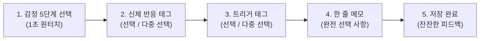

# [PRD] Phase 1: 직관적인 감정 기록 (Emotion Tracking MVP)

| 항목 | 내용 |
| :--- | :--- |
| **문서 버전** | v1.0 |
| **작성일** | 2026-08-27 |
| **상태** | Draft / Ready for Development |
| **목표 일정** | Phase 1 MVP 릴리즈 |

---

## 1. 배경 및 목적 (Background & Objectives)

### 1.1 배경 (Problem Statement)
- **성인 ADHD 및 아스퍼거 증후군(자폐 스펙트럼)의 특성**:
  - 감정 표현 불능증(Alexithymia) 경향: 현재 내 감정이 무엇인지 언어로 구체화하는 데 높은 인지적 에너지가 소모됨.
  - 실행 기능 저하(Executive Dysfunction): 텍스트 일기나 복잡한 서식 작성을 마주하면 과부하가 걸려 기록 자체를 포기하게 됨.
  - 감각 및 외부 자극 과민: 화려한 UI, 복잡한 통계, 푸시 알림, 연속 기록(Streak) 압박은 '실패감'과 '자기 비난'으로 이어짐.
- **번아웃 이후의 결심**:
  - 끊임없는 자기 개발과 채찍질 대신, **지금 내 상태를 있는 그대로 알아차리고 수용하는 안전한 도구**가 필요함.

### 1.2 핵심 목적 (Objectives)
1. **1초 퀵 기록**: 글을 쓰기 힘들 만큼 방전된 상태에서도 단 한 번의 터치로 현재 상태를 남길 수 있는 환경 구축.
2. **신체 감각과 감정의 연결(Somatic Awareness)**: 감정을 말로 표현하기 힘들 때 신체 반응(호흡, 근육 긴장도 등)과 외부 트리거로 상태를 구체화.
3. **평가 없는 기록 공간**: 기록을 채점하거나 연속 기록을 강요하지 않고, 언제 돌아와도 고요하게 품어주는 쉼터 제공.

---

## 2. 타겟 페르소나 및 사용자 시나리오 (User Persona & Stories)

### 페르소나
- **이름**: 개발자 본인 (20~30대 개발자, 성인 ADHD & 아스퍼거 증후군 보유, 여행 및 캠핑을 통한 힐링을 즐김)
- **현재 상태**: 번아웃 후 회복 중. 뇌의 인지적 잔여 에너지가 낮으며 감정 기복과 감각 피로에 취약함.

### 사용자 스토리 (User Stories)
- **US-1**: "에너지가 0%인 날에도 부담 없이, 1초 만에 색상이나 아이콘을 눌러 지금 기분을 기록하고 싶다."
- **US-2**: "내 감정이 슬픈지 불안한지 모호할 때, '가슴 답답함', '머리 지끈거림', '어깨 긴장' 같은 신체 반응을 탭하여 내 상태를 알아차리고 싶다."
- **US-3**: "이 감정을 일으킨 상황(소음, 대인관계, 수면 부족, 라이딩 등)을 태그로 가볍게 묶어두고 싶다."
- **US-4**: "글을 한 글자도 쓰지 않아도 저장이 완료되고, 원할 때만 한 줄 메모를 덧붙이고 싶다."
- **US-5**: "과거의 기록을 볼 때 복잡한 그래프에 압도되지 않고, 차분한 타임라인으로 '내가 이 시간들을 묵묵히 통과해 왔구나'를 느끼고 싶다."

---

## 3. 상세 기능 요구사항 (Functional Requirements)

### 3.1 감정 5단계 체크 (Core Emotion Level)
- 사용자는 5단계의 직관적인 감정 단계 중 하나를 선택한다.
- 텍스트 라벨과 함께 저채도의 부드러운 컬러/아이콘을 제공한다.

| 레벨 | 명칭 (내부 코드) | 시각적 의미 | 색상 톤 (저채도/편안한 톤) |
| :---: | :--- | :--- | :--- |
| **1** | `DEEP_HEAVY` (몹시 지침/괴로움) | 깊은 침체, 감각 과부하, 에너지 고갈 | 차분한 딥 네이비 / 슬레이트 그레이 |
| **2** | `UNEASY_LOW` (불안함/가라앉음) | 안절부절못함, 답답함, 가벼운 우울 | 연한 더스티 블루 / 뮤트 블루 |
| **3** | `CALM_NEUTRAL` (담담함/보통) | 자극 없음, 그저 그런 하루, 잔잔함 | 세이지 그린 / 부드러운 얼스 톤 |
| **4** | `COMFORTABLE` (편안함/소소한 온기) | 안도감, 잔잔한 만족, 이완됨 | 따뜻한 샌드 베이지 / 소프트 코랄 |
| **5** | `BRIGHT_ENERGIZED` (충만함/가벼움) | 머리가 맑음, 생동감, 활력 | 은은한 웜 옐로우 / 올리브 골드 |

### 3.2 신체 반응(Somatic Response) 태그
- 감정을 인지하기 전 나타나는 신체적 반응을 체크할 수 있는 빠른 태그 목록을 제공한다.
- **기본 제공 태그**:
  - `[가슴 답답함]`, `[호흡이 얕음]`, `[두통/머리 무거움]`, `[턱/어깨 긴장]`, `[위장 불편감]`, `[눈 피로/빛 과민]`, `[온몸 무기력]`, `[심장 두근거림]`, `[깊은 이완/호흡 편안]`, `[몸이 가벼움]`
- 사용자가 자신만의 신체 반응 태그를 추가/삭제할 수 있다.

### 3.3 트리거 & 활동(Trigger & Context) 태그
- 당시 상황이나 환경 요인을 선택한다.
- **기본 제공 태그**:
  - `[대인관계/대화]`, `[소음/외부 자극]`, `[업무/해야 할 일]`, `[수면 부족]`, `[혼자만의 시간]`, `[모터사이클/라이딩]`, `[자연/산책]`, `[식사/카페인]`, `[휴식/멍때리기]`
- 커스텀 태그 추가/관리 지원.

### 3.4 선택형 마이크로 메모 (Micro Note)
- **필수 여부**: 100% 선택 사항 (0글자 입력 시에도 완벽히 저장됨).
- **Placeholder**: *"하고 싶은 말이 떠오를 때만 적어도 괜찮아요."*
- **입력 편의**: 엔터 또는 단축키(Ctrl+Enter)로 즉시 저장.

### 3.5 저자극 타임라인 및 캘린더 (Timeline View)
- 기록된 감정을 시간순(일별/월별)으로 확인하는 뷰.
- **캘린더 뷰**: 일자별 감정 색상이 은은한 원형 점(Dot) 또는 소프트 블록으로 표시.
- **일기 상세/수정/삭제**: 과거 기록을 언제든 열람, 수정, 삭제 가능.
- **통계에 대한 원칙**:
  - ❌ *"이번 달 3일 빼먹으셨네요!"* 같은 경고나 빈칸 강조 금지.
  - ⭕ 내가 기록한 순간들이 고요히 점으로 찍혀 있는 잔잔한 궤적 시각화.

---

## 4. 비기능 요구사항 (Non-Functional Requirements)

| 분류 | 요구사항 상세 |
| :--- | :--- |
| **인지 부하 최소화** | 화면 전환을 최소화하고, 필수 단계는 1탭으로 종료 가능하도록 설계. |
| **시각적 편안함** | 기본 다크 모드 및 저채도 뉴트럴 팔레트 지원. 깜빡임이나 강한 대비 배제. |
| **반응 속도** | 감정 버튼 클릭 후 저장 완료까지 200ms 이내 피드백 제공 (지연 없는 쾌적함). |
| **심리적 안전감** | 실패/경고 메시지를 단정적이지 않고 포용적인 톤으로 작성 ("잠시 쉬어가도 괜찮아요"). |
| **데이터 보안** | 민감한 개인 감정 데이터이므로 Spring Security 기반 인증 및 로컬/개인 암호화 보장. |
| **확장성** | 백엔드 API를 RESTful하게 구성하여 추후 Flutter 모바일 클라이언트 도입 시 재사용. |

---

## 5. REST API 명세 (Draft)

### 감정 기록 관련 API (`/api/v1/emotions`)

| Method | Endpoint | 설명 | Request Body / Params | Response |
| :---: | :--- | :--- | :--- | :--- |
| `POST` | `/api/v1/emotions` | 새로운 감정 기록 생성 | `{ emotionLevel, tagIds: [], memo, recordedAt }` | `201 Created` (생성된 로그 객체) |
| `GET` | `/api/v1/emotions` | 감정 기록 목록 조회 (페이징/월별) | `?year=2026&month=8&page=0&size=30` | `200 OK` (로그 목록) |
| `GET` | `/api/v1/emotions/{id}` | 특정 감정 기록 단건 조회 | Path variable `id` | `200 OK` (상세 로그) |
| `PUT` | `/api/v1/emotions/{id}` | 감정 기록 수정 | `{ emotionLevel, tagIds: [], memo, recordedAt }` | `200 OK` (수정된 로그) |
| `DELETE` | `/api/v1/emotions/{id}` | 감정 기록 삭제 | Path variable `id` | `204 No Content` |

### 태그 관련 API (`/api/v1/tags`)

| Method | Endpoint | 설명 | Request Body / Params | Response |
| :---: | :--- | :--- | :--- | :--- |
| `GET` | `/api/v1/tags` | 사용 가능한 태그 목록 (기본+커스텀) | `?category=BODY_RESPONSE` | `200 OK` (태그 리스트) |
| `POST` | `/api/v1/tags` | 커스텀 태그 추가 | `{ name, category, icon }` | `201 Created` |
| `DELETE` | `/api/v1/tags/{id}` | 커스텀 태그 삭제 | Path variable `id` | `204 No Content` |

---

## 7. UI/UX 와이어프레임 & 인터랙션 흐름

### 🖥️ 화면 구성 (Single Page / Dashboard 중심)

1. **상단 네비게이션**: 
   - 고요한 로고 (`AmorFati 🌿`), 현재 날짜/시간, 미니멀 프로필/설정
2. **메인 감정 체크 카드 ("지금 내 마음과 몸은 어떤가요?")**:
   - 5개의 커다랗고 둥근 감정 버튼 (`1 딥네이비` ~ `5 웜골드`)
   - 감정 버튼 클릭 시 부드러운 햅틱/글로우 효과와 함께 하단 태그 패널 확장
3. **신체 감각 태그 섹션 ("몸에서 느껴지는 신호가 있나요?")**:
   - 알약 형태(Pill-style)의 부드러운 칩 버튼 다중 선택
4. **트리거 태그 섹션 ("어떤 상황이었나요?")**:
   - 알약 형태의 상황 칩 버튼 다중 선택
5. **마이크로 메모 ("남기고 싶은 생각이 있다면")**:
   - 1~2줄 높이의 심플한 텍스트 영역 (비워두어도 무방)
6. **저장 버튼 ("내려놓기")**:
   - 클릭 시 부드럽게 페이드아웃되며 하단 타임라인에 차분히 등록
7. **하단 타임라인/캘린더**:
   - 오늘 남긴 감정들의 흐름과 이번 달의 은은한 감정 궤적

---

## 8. 개발 체크리스트 및 다음 단계

- [ ] **기반 구축**: JPA Entity 설계 (`Member`, `EmotionLog`, `Tag`, `EmotionLogTag`)
- [ ] **Repository & Service**: 감정 CRUD 및 태그 관리 비즈니스 로직 작성
- [ ] **REST Controller & Thymeleaf Controller**: 화면 렌더링 및 비동기 API 엔드포인트 구현
- [ ] **프론트엔드 UI 구축**: Tailwind CSS 기반의 저자극 다크/뉴트럴 테마 및 1초 체크 폼 제작
- [ ] **통합 테스트**: 1초 기록 및 타임라인 렌더링 검증
- [ ] **Phase 2 준비**: 감정보관소 및 최소 체크리스트 설계
